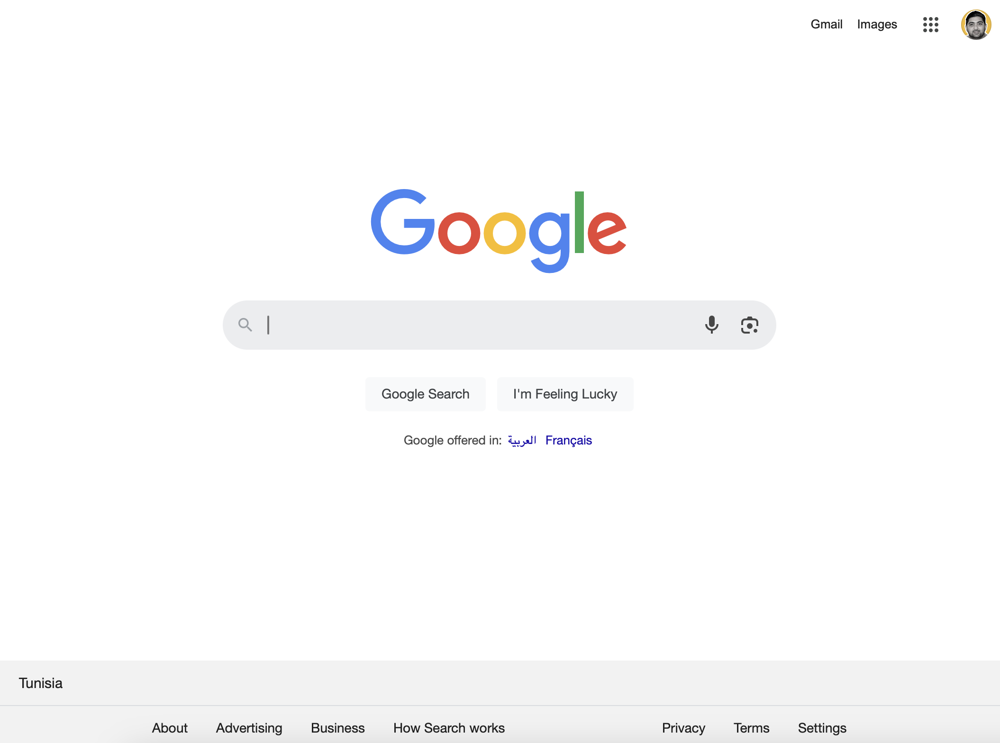

## Part 1 
1) React First Project
### 
Create the first react app and create the first component named `App` with Hello World inside `<h1>`

2) React Components
###
Create component called `Hi.jsx` with function declaration syntax `<h2>` with some text inside this component

Create component called `Hello.jsx` with arrow function syntax `<h1>` with some text inside this component

Register `Hi` and `Hello` in your `App.jsx` and run the app 

## Part 2
1) Break Down the UI into Components
###

Take a look at the provided UI. Your task is to divide it into multiple React components. 

You don't need to write any code for this step. Simply use a pen and paper or a photo editing tool to visualize how the UI can be split into different components. 

This exercise will help you get a better understanding of component structure in React.
